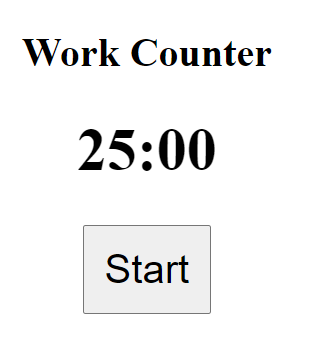
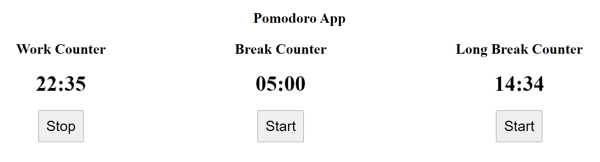
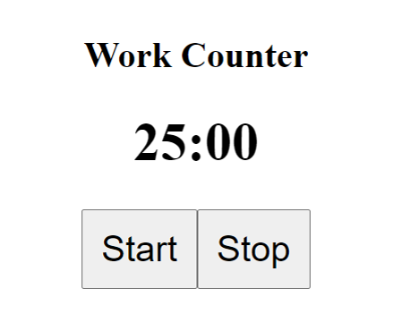

# 🍅Vue Pomodoro Application🍅

### Category   ➡️   Software

### Subcategory   ➡️   Vue JS

### Difficulty   ➡️   (Easy)

## 🌐 Introduction

This application is designed to create a Pomodoro which is an application based on a productivity technique with which it is divided into 4 Cycles of 25 minutes of work and between each cycle 5 minutes of rest are taken, at the end of the cycle you can take a long break of 15 minutes.

The objective of this activity is to create an application with 3 counters categorized as

1. Work Counter - 25 minutos
1. Break Counter - 5 minutos
1. Long Break Counter - 15 minutos

## 🎯 Objectives

1. **Objective 1**: Complete BreakCounter.vue
2. **Objective 2**: Complete WorkCounter.vue
3. **Objective 3**: Complete Pomodoro.vue
4. **Objective 4**: Complete LongBreakCounter.vue

## 📂 Repository Structure

A repository tree is provided below and should not be modified. Everything you need to develop the challenge is already included.
```bash
yirsis-vue-pomodoro/
├── bash.exe.stackdump
├── docs
│   ├── components.png
│   ├── paso1.png
│   ├── result.png
│   └── stop.png
├── index.html
├── package.json
├── pnpm-lock.yaml
├── public
│   └── favicon.ico
├── README.md
├── src
│   ├── App.vue
│   ├── assets
│   │   ├── base.css
│   │   ├── logo.svg
│   │   └── main.css
│   ├── components
│   │   ├── BreakCounter.vue
│   │   ├── LongBreakCounter.vue
│   │   ├── Pomodoro.vue
│   │   ├── __tests__
│   │   │   ├── BreakCounter.spec.js
│   │   │   ├── LongBreakCounter.spec.js
│   │   │   ├── Pomodoro.spec.js
│   │   │   └── WorkCounter.spec.js
│   │   └── WorkCounter.vue
│   └── main.js
├── vite.config.js
└── vitest.config.js
```
**It is necessary to modify only the files proposed in the objectives.**

## 📋 Requirements

The application must have 3 counters with the following format

```sh
  12:18 # Minutes:Seconds
```

Each counter must be isolated in the Vue.js Virtual DOM using the concept of components.

Each component must be composed of 3 HTML elements, which will be

- Title
- Counter with the requested format
- Start/Stop button (dynamic rendering)

The result should be similar to this



The final result must be represented on the same screen by 3 components with the following structure



## 📃 Instructions

In order to begin the challenge, it is necessary to obtain access to the project and execute it. For this, it is necessary that your environment has

1. A code editor such as VS Code, WebStorm or Vim, etc.
1. Node.js >= v18.
1. A dependency manager like NPM, YARN or PNPM, in the document everything will be done with `npm` but it is a personal decision which to use.
1. A web browser such as Firefox, Google Chrome or Microsoft Edge.

Once your team has everything necessary, you must follow these steps to be able to execute the base project

1. Clone the app repository
1. Install the node_modules with the `npm install` command
1. Run the project locally using the `npm run dev` command and open the application in a browser at the address `http://localhost:3000`

Once you are able to see the Vue.js application within your browser, the next important step is for you to know the directory structure you are working with.

```sh
src
    ├───assets
    └───components
        └───Pomodoro.vue
        └───WorkCounter.vue
        └───BreakCounter.vue
        └───LongBreakCounter.vue
```

Inside the components folder you will find the `Pomodoro.vue` component that already contains the initial structure of the application.

The rest of the components are independent, let's take into account that this exercise is designed to be solved using the **Options API** of Vue.js, so we will leave features such as reactive references, reactive objects or the setup of the Composition API, outside of this exercise.

We will proceed to open the `WorkCounter.vue` where we will find the HTML that generates this, the Data and Methods object, which will have to be implemented.



At the code level, the following structure is found in the State of the component

```js
{
  data: () => ({
    counter: 0,
    intervalId: null,
    isStarted: false,
    isStoped: true,
  }),
}
```

The state will be in charge of managing several things.

1. The `counter` is in charge of managing the total seconds in this case of 25 minutes, the formula is `60 seconds * 25 minutes = 1500` so in this case, counter must be worth 1500
2. The `intervalId` is a variable that stores the ID of the setInterval to be able to clear it when stopping the counter so that multiple intervals are not started, due to performance and synchronization issues in the application.
3. Finally, the control variables `isStarted, isStoped` are just that, control variables to know when the counter is active and not, this can be reduced to 1 single variable, but for now we will use 2 to facilitate the exercise.

In the methods part we will find this structure

```js
methods: {
    start() {
      console.log("start function called");

      this.isStarted = true;
      this.isStoped = false;

      this.intervalId = setInterval(() => {}, 1000);
    },
    stop() {
      console.log("stop function called", this.intervalId);

      this.isStarted = false;
      this.isStoped = true;
    },
    formattedTime(counter = 10) {
      return `25:00`;
    },
  },
```

These methods are the ones that we will have to implement in detail

### Start Method

Within the start method we find the control variables becoming active and a setInterval that stores the id to clear it later.

Here we must reduce the number of seconds by 1 and check that the value cannot be reduced less than 0, in which case we must reset the counter value to 1500

### Stop Method

Within the stop method we find the control variables going to an inactive state, here the important thing is to clean the interval using its ID.

### FormattedTime Method

This method returns a string that is exactly 25:00 and receives the counter as a parameter.

To convert the first segment from seconds to minutes we must use the Math.floor function to obtain an integer ignoring its decimals and with the formula `seconds / 60` to obtain 25, the rest is to format the text so that it is 02 for example , adding the 0 when only one character exists, this can be done in many ways but **I personally recommend using toString and padStart to easily achieve that**.

Finally, formatting the second part of the segment is the same as the previous one, only the formula is not a division but we will search for the rest with the formula `seconds % 60`, if everything is correct, when the start button is pressed, we will have to being able to see how every second the seconds counter goes down.

The last thing is to generate the dynamic rendering in the start and stop button, for this use the control variables correctly

To complete the challenge, replicate this in the `BreakCounter.vue -> 5 Minutes` and `LongBreak.vue -> 15 Minutes` components.

## 📊 Evaluation

The final score will be given according to whether or not the objectives have been met.

In this case, the challenge will be evaluated on 900 points which are distributed as follows:

- Objective 1: 225 points
- Objective 2: 225 points
- Objective 3: 225 points
- Objective 4: 225 points

## 📤 Submission

1. Solve the proposed objectives.
2. Push the changes you have made.
3. Click on Submit Challenge.
4. Wait for the results.